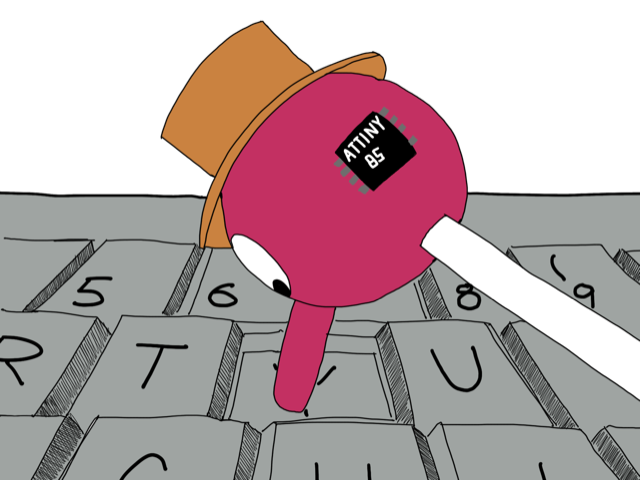
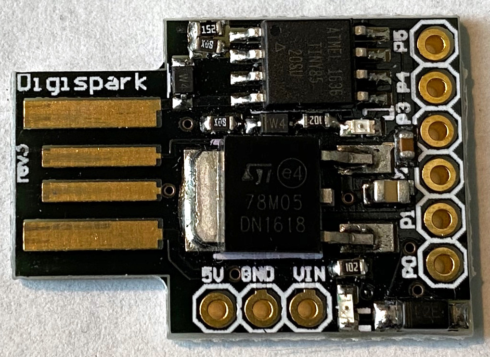

# Simpson Device 

An USB mouse interpretation of Homers [Drinking
Bird](https://en.wikipedia.org/wiki/Drinking_bird), from "The Simpsons"
[S07E07](https://en.wikipedia.org/wiki/King-Size_Homer).  which randomly
simulates movements of an USB mouse. Successfully tested on Linux, Windows,
Mac.

Use-Case: e.g. prevent your screen saver from launching (presence simulation ;)

## Instructions

A [Digispark Attiny85 Board](http://digistump.com/products/1) is used to 
simulate an USB mouse.

To build the firmware, this project uses [platformio](https://platformio.org).
Run `cd firmware && make && make upload` to build it and upload the firmware.

See https://www.thingiverse.com/thing:2182039 for a tiny case for the digispark.

## License

MIT

## Author

(c) Copyright 2020 Jan Delgado

